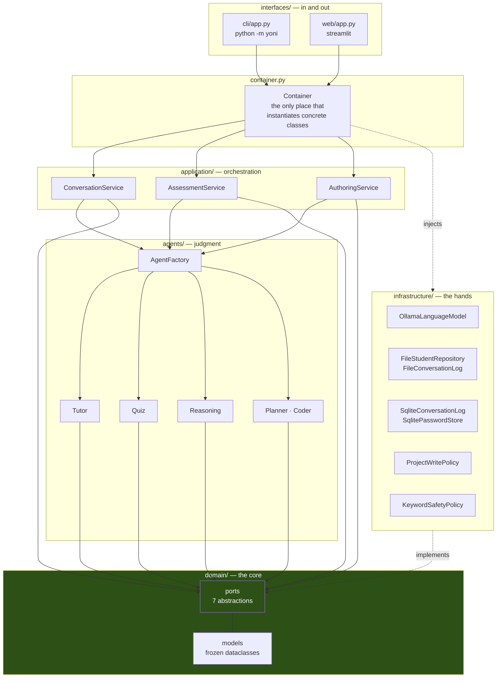
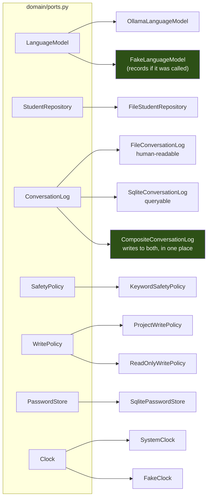
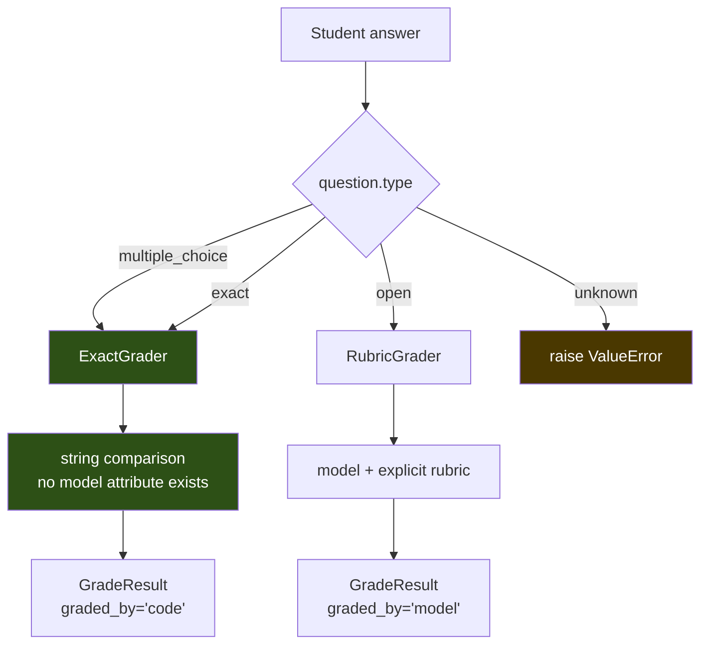
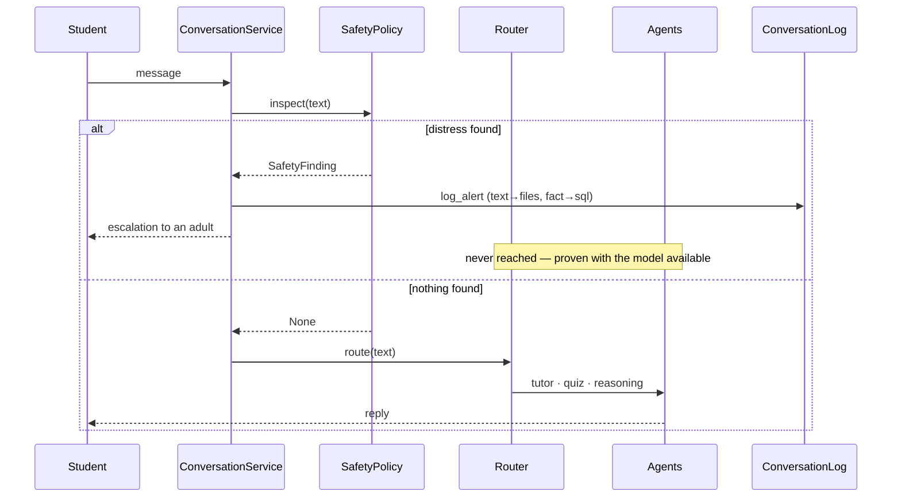
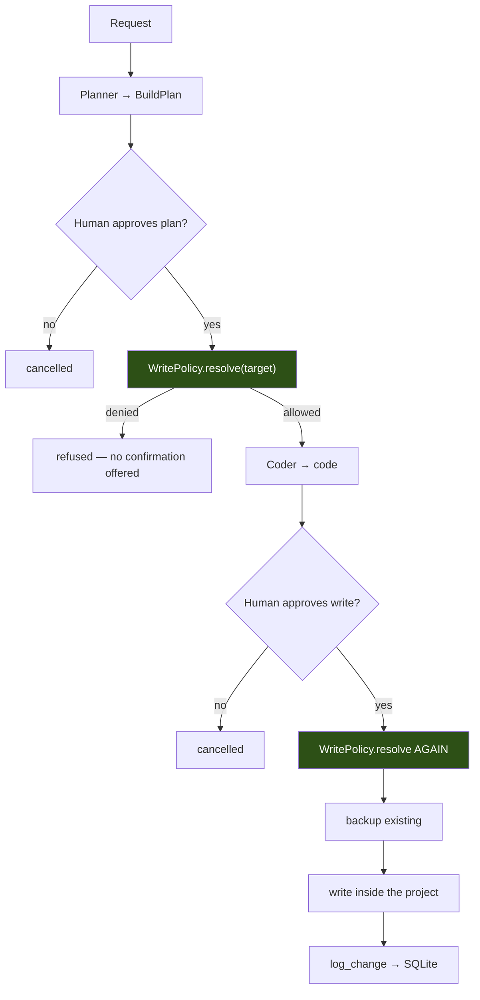
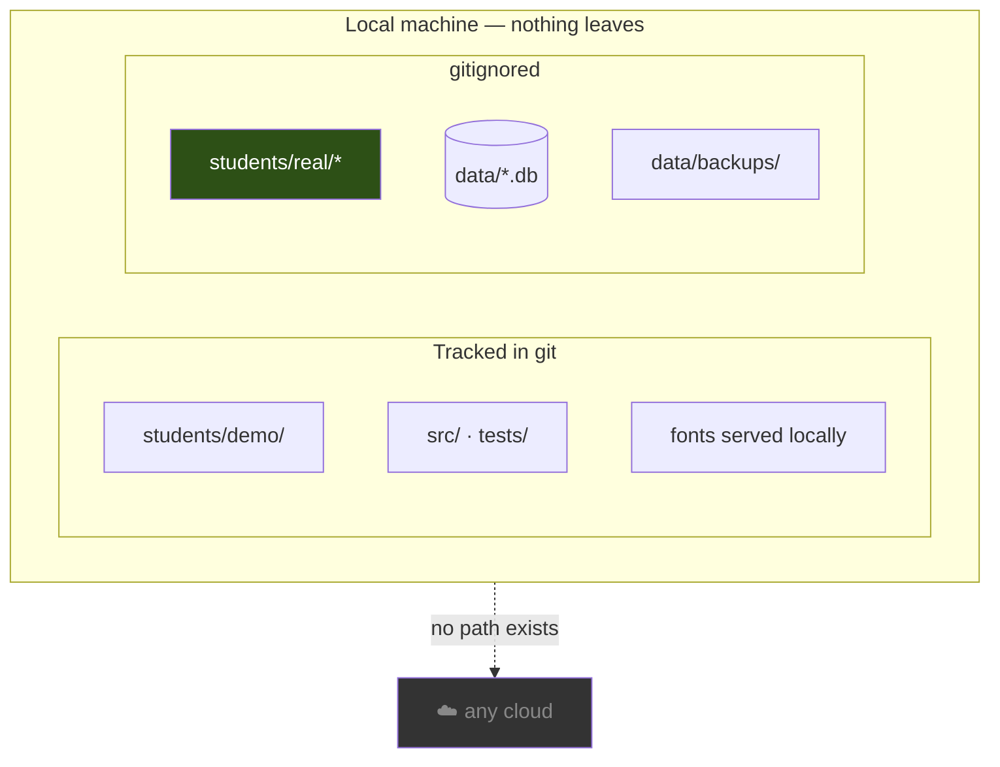
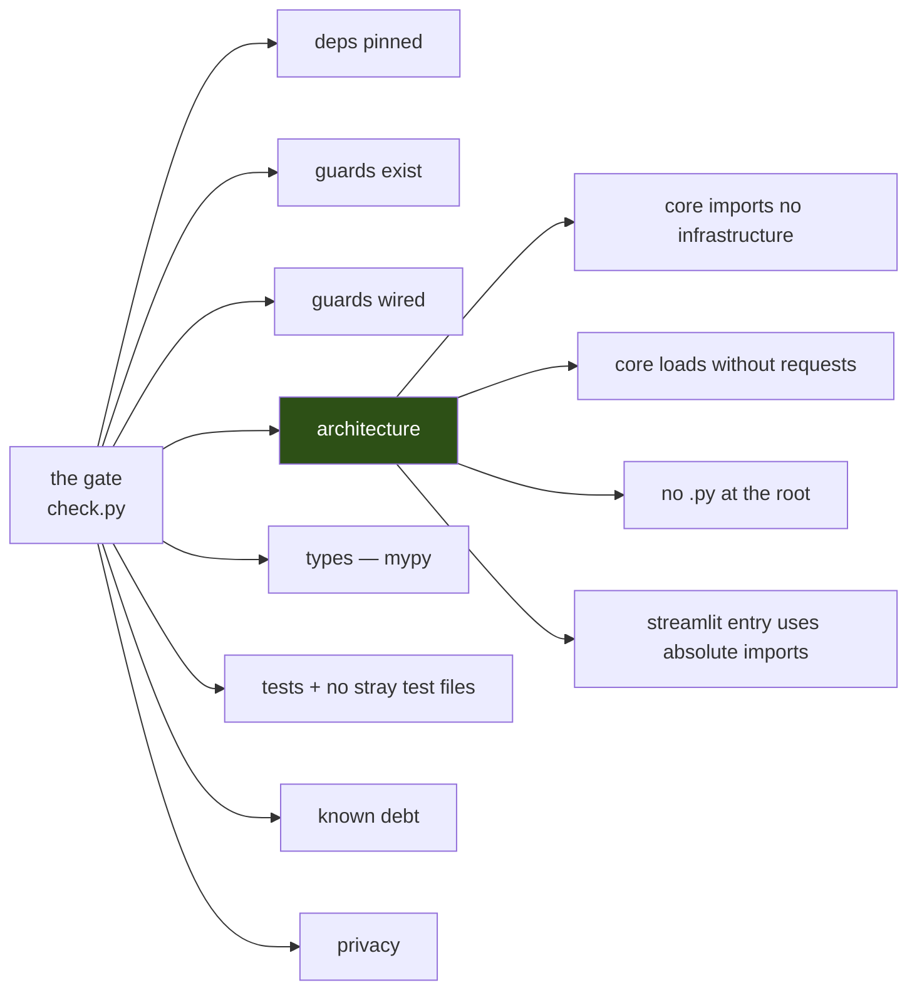

# Status Diagrams — YAARIM

> **Last updated:** 2026-07-30 (rewritten after the hexagonal refactor)

Diagrams derived from the code as it stands. Where a diagram claims a guarantee, the guarantee is
enforced by `scripts/check.sh` — noted on the diagram itself.

## Layers — one direction of dependency



Green = the layer that knows nothing about the outside. **`check.sh` verifies this twice**: by grep
on the layer folders, and by loading the core with `requests` neutralised. The arrows into `domain`
only ever point inward.

## The ports and their implementations



Every port has a real second case — none is speculative. `FakeLanguageModel` is what makes "the model
was not called" a **measured** claim. `CompositeConversationLog` is where the old two-store debt
became one explicit decision.

## Quiz grading — the iron rule, now structural



Before the refactor this was a convention held by discipline. Now `ExactGrader` has **no model
attribute at all** — a closed question cannot reach the LLM even by mistake. A test asserts the
absence directly.

## Distress — the door that precedes everything



## Dependency injection — who builds what

```mermaid
graph TD
    ENV["Settings.from_env()"] --> CONT["Container"]
    CONT -->|lazy, once| LLM["LanguageModel"]
    CONT -->|lazy, once| REPO["StudentRepository"]
    CONT -->|lazy, once| LOG["ConversationLog"]
    CONT -->|lazy, once| POL["WritePolicy"]
    CONT -->|lazy, once| SAFE["SafetyPolicy"]
    CONT --> SERV["Services + AgentFactory"]
    LLM & REPO & LOG & POL & SAFE --> SERV

    TEST["Test"] -.->|Container(language_model=Fake…)| CONT

    style TEST fill:#2d5016,color:#fff
```

No class builds its own dependencies. That is why the whole suite runs with **zero `patch` of
modules** — a test injects a different object and nothing else changes.

## The `/build` write gate



The policy runs **twice** — at resolve and at commit. Human approval sits between them and cannot
replace either. In the container, only the project is mounted, so what the policy refuses does not
exist in the namespace to begin with.

## Student data perimeter



Hebrew web fonts are embedded from `src/yoni/interfaces/web/fonts/` — a child's browser never calls
Google to draw letters.

## What the gate checks



Four of these exist because something actually broke during the session that produced them. That is
the intent: what must hold goes into code, because vigilance already failed once.

## Links

- [Global Status](status.md)
- [Global Roadmap](roadmap.md)

---

## How to Update

1. These diagrams are derived from source. Re-derive after structural change — do not patch them.
2. A green fill means the property is enforced by `check.sh`. Only colour a node green when a check
   actually exists; otherwise it is a wish wearing the costume of a guarantee.
3. `Documentation/CodeReference/` was generated **before** the refactor and its module map is stale.
